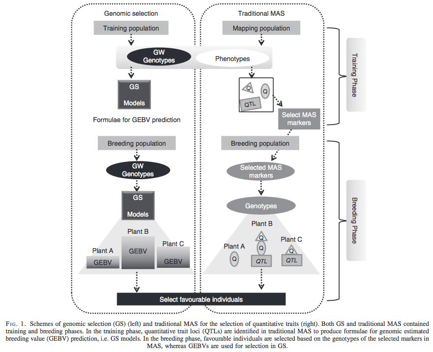
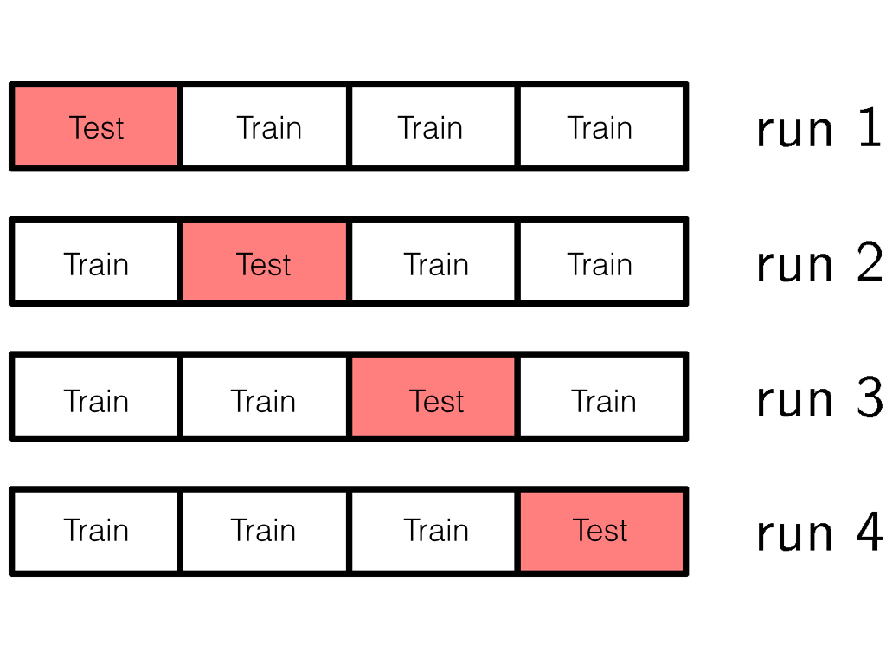

```{r setup, include=FALSE}
options(htmltools.dir.version = FALSE)
```


# GWAS vs. Prediction

.right[[Wikimedia Commons](https://commons.wikimedia.org/wiki/File:Manhattan_Plot.png)]


---
# Missing heritability

.right[[doi:10.1038/456018a](https://www.nature.com/news/2008/081105/full/456018a.html)]


- Variance explained by genome-wide significant SNPs (GWAS heritability)

- Variance explained by all SNPs on the DNA microarray chip (genomic heritability)

- Variance explained by pedigree (trait heritability)

--

GWAS heritability $<$  genomic heritability  $\leq$ trait heritability


---
# Genomic prediction - use all available markers

.center[[Meuwissen et al. (2001)](http://www.genetics.org/content/157/4/1819)]


.pull-left[
- Genomic selection
- Genome-enabled selection
- Genome-assisted selection
- Genomic prediction
- Genome-enabled prediction
- Genome-assisted prediction
]

.pull-right[
- generation interval
- prediction performance
]


---
# Genomic selection vs. Marker assisted selection
<div align="center">
<p><a href="https://academic.oup.com/aob/article/110/6/1303/110713"> Nakaya and Isobe (2012)</a>
</div>


---
# How to fit all SNPs simultaneously?

* add a penalty function to OLS (e.g., ridge regression and LASSO)

* treat SNPs as random effects (BLUP)

* become a Bayesian 


---
class: inverse, center, middle

# GBLUP


---
# Genomic best linear unbiased prediction
Suppose underlying signal is given by  
$$
\mathbf{y} = \mathbf{g} + \boldsymbol{\epsilon}
$$

We approximate the vector of genetic values $\mathbf{g}$ with a linear function  

$$
\mathbf{y} = \mathbf{W}\mathbf{a} + \boldsymbol{\epsilon}
$$

- $\mathbf{W}$ is the centered $n$ $\times$ $m$ matrix of additive marker genotypes 

- $\mathbf{a}$ is the vector of regression coefficients on marker genotypes 

- $\boldsymbol{\epsilon}$ is the residual 


---
# Genomic best linear unbiased prediction
Variance-covariance matrix of $\mathbf{y}$ is
\begin{align*}
\mathbf{V}_y &= \mathbf{V}_g + \mathbf{V}_{\epsilon} \\
&= \mathbf{WW'}\sigma^2_{a} + \mathbf{I} \sigma^2_{\epsilon}
\end{align*}

- $\mathbf{a} \sim N(0, \mathbf{I}\sigma^2_{\mathbf{a}})$  

- $\boldsymbol{\epsilon} \sim N(0, \mathbf{I}\sigma^2_{\boldsymbol{\epsilon}})$

- $\mathbf{V}_g = \mathbf{WW'}\sigma^2_{a}$ is the covariance matrix due to markers


---
# Genomic best linear unbiased prediction
If normality is assumed, the best linear unbiased prediction (BLUP) of $\mathbf{g}$ $(\hat{\mathbf{g}})$ is the conditional mean of $\mathbf{g}$ given the data  
\begin{align}
BLUP(\hat{\mathbf{g}}) &= E(\mathbf{g}|\mathbf{y}) = E[\mathbf{g}] + Cov(\mathbf{g}, \mathbf{y}^T) Var(\mathbf{y})^{-1}  [\mathbf{y} - E(\mathbf{y})] \notag \\
&=  Cov(\mathbf{W}\mathbf{a}, \mathbf{y}^T)\cdot \mathbf{V}_y^{-1}  \mathbf{y}  \notag \\
&= \mathbf{WW'}\sigma^2_{\mathbf{a}} [\mathbf{WW'}\sigma^2_{a} + \mathbf{I} \sigma^2_{\epsilon}]^{-1}  \mathbf{y}  \notag \\
&= [\mathbf{I} +    \frac{\sigma^2_{\epsilon}}{\mathbf{WW'}\sigma^2_{a}} ]^{-1}  \mathbf{y}  \\
&= [\mathbf{I} +  (\mathbf{WW'})^{-1}  \frac{\sigma^2_{\epsilon}}{\sigma^2_{a}} ]^{-1}  \mathbf{y}, 
\end{align}
assuming that $\mathbf{WW'}$ is invertible

- $Cov(\mathbf{W}) = \mathbf{WW'}$  is a covariance matrix of marker genotypes (provided that $X$ is centered), often considered to be the simplest form of additive genomic relationship kernel, $\mathbf{G}$. 


---
# Genomic best linear unbiased prediction
We can refine this kernel $Cov(\mathbf{W}) = \mathbf{WW'}$ by relating genetic variance $\sigma^2_g$ and marker genetic variance $\sigma^2_{a}$ under the following assumptions

Assume genetic value is parameterized as 
$g_{i} = \sum w_{ij} a_j$ 
where both $x$ and $a$ are treated as random and independent. 

Assuming linkage  equilibrium of markers (all loci are mutually independent) 
\begin{align*}
\sigma^2_g &= \sum_j 2 p_j(1-p_j) \cdot \sigma^2_{a_j}. \notag \\
\end{align*}
Under the homogeneous marker variance assumption
\begin{align}
\sigma^2_{a} &= \frac{\sigma^2_g}{2 \sum_j p_j(1-p_j) }.
\end{align}


---
# Genomic best linear unbiased prediction
Recall that 
\begin{align}
BLUP(\hat{\mathbf{g}}) &= [\mathbf{I} +  (\mathbf{WW'})^{-1}  \frac{\sigma^2_{\epsilon}}{\sigma^2_{a}} ]^{-1}  \mathbf{y}, 
\end{align}

Replacing $\sigma^2_{\beta}$ we get 
\begin{align}
BLUP(\hat{\mathbf{g}}) &= \left [\mathbf{I} +    (\mathbf{WW'})^{-1} \frac{\sigma^2_{\epsilon}}{ \frac{ \sigma^2_{g}}{2 \sum_j p_j(1-p_j)}} \right ]^{-1}  \mathbf{y}  \notag \\ 
&= \left [\mathbf{I} +    \mathbf{G}^{-1} \frac{\sigma^2_{\epsilon}}{ \sigma^2_g} \right ]^{-1}  \mathbf{y}  
\end{align}
where $\mathbf{G} = \frac{\mathbf{WW'}}{2 \sum_j p_j(1-p_j)}$ is known as the first $\mathbf{G}$ matrix  introduced in VanRaden (2008)


---
class: inverse, center, middle

# RRBLUP


---
## BLUP of marker effects 
Suppose that the phenotype-genotype mapping function is 
\begin{align*}
\mathbf{y} &= \mathbf{g} + \boldsymbol{\epsilon} \\
\mathbf{y} &= \mathbf{W}\mathbf{a} + \boldsymbol{\epsilon} \\
\mathbf{a} &\sim N(0, \mathbf{I}\sigma^2_{a})  
\end{align*}
The conditional expectation of $\mathbf{a}$ given $\mathbf{y}$ is 
\begin{align*}
BLUP(\mathbf{a}) &= E(\mathbf{a}| \mathbf{y})= Cov(\mathbf{a}, \mathbf{y})Var(\mathbf{y})^{-1} [\mathbf{y} - E(\mathbf{y})] \\
&= Cov(\mathbf{a}, \mathbf{W}\mathbf{a}) [\mathbf{W}\mathbf{W'} \sigma^2_{\mathbf{a}}+ \mathbf{I}\sigma^2_{\boldsymbol{\epsilon}}]^{-1} \mathbf{y} \\
&= \sigma^2_{\mathbf{a}} \mathbf{W}' [\mathbf{W}\mathbf{W'} \sigma^2_{\mathbf{a}} + \mathbf{I}\sigma^2_{\boldsymbol{\epsilon}}]^{-1} \mathbf{y} \\
&= \sigma^2_{\mathbf{a}} \mathbf{W'}  (\mathbf{W}\mathbf{W'})^{-1} [ \sigma^2_{\mathbf{a}}\mathbf{I} + (\mathbf{W}\mathbf{W'})^{-1} \sigma^2_{\boldsymbol{\epsilon}}]^{-1}  \mathbf{y} \\
&=  \mathbf{W}^T  (\mathbf{W}\mathbf{W'})^{-1} [ \mathbf{I} + (\mathbf{W}\mathbf{W'})^{-1}  \frac{\sigma^2_{\boldsymbol{\epsilon}}}{\sigma^2_{\mathbf{a}}} ]^{-1}  \mathbf{y}.
\end{align*}

Alternatively,
\begin{align*}
BLUP(\mathbf{a}) &=  \mathbf{W}^T [ (\mathbf{W}\mathbf{W'}) +  \frac{\sigma^2_{\boldsymbol{\epsilon}}}{\sigma^2_{\mathbf{a}}}\mathbf{I} ]^{-1}  \mathbf{y}. 
\end{align*}


---
# BLUP of marker effects 
Thus, 
\begin{align*}
BLUP(\mathbf{a}) &= \mathbf{W}^T  (\mathbf{W}\mathbf{W'})^{-1} [ \mathbf{I} + (\mathbf{W}\mathbf{W'})^{-1}  \frac{\sigma^2_{\boldsymbol{\epsilon}}}{\sigma^2_{\mathbf{a}}} ]^{-1}  \mathbf{y} \\
&=  \mathbf{W'}  (\mathbf{W}\mathbf{W'})^{-1} BLUP(\mathbf{g}).
\end{align*}
Thus, once we obtain $\hat{\mathbf{g}}$ from GBLUP, BLUP of marker coefficients is given by 
$\hat{\mathbf{a}} = \mathbf{W'} (\mathbf{W}\mathbf{W'})^{-1} \hat{\mathbf{g}}$


---
# How to evaluate prediction performance
Cross-validation

- take model uncertainty into account

- divide data into training and testing sets

- train the model in the training set

- evaluate predictive performance in the testing set

- predictive correlation: $r = cor(\mathbf{y}, \hat{\mathbf{y}})$

- predictive correlation squared: $R^2 = cor(\mathbf{y}, \hat{\mathbf{y}})^2$

- mean-squared error: $\sum(y - \hat{y})^2/n_{test}$


---
# Cross-validation
<div align="center">

</div>
.right[[doi:10.1093/jas/sky014](http://dx.doi.org/10.1093/jas/sky014)]


---
# K-fold Cross-validation
<div align="center">

</div>
.right[[PRML](https://www.microsoft.com/en-us/research/people/cmbishop/)]


---
# Cross-validation for RRBLUP 
Training and testing sets partitioning 
\begin{align*}
\text{Training} &\in (\mathbf{y}_{trn},\mathbf{W}_{trn} )  \\
\text{Testing} &\in (\mathbf{y}_{tst},\mathbf{W}_{tst} )  \\
\mathbf{y}_{trn} &= \mathbf{W}_{trn} \hat{\mathbf{a}}_{trn} + \mathbf{e}_{trn} \\
\end{align*}

How to do a cross-validation?

--

\begin{align*}
\hat{\mathbf{y}}_{tst} &= \mathbf{W}_{tst} \hat{\mathbf{a}}_{trn} 
\end{align*}

--

Then evaluate 
\begin{align*}
Cor(\mathbf{y}_{tst}, \hat{\mathbf{y}}_{tst}) = 
Cor(\mathbf{y}_{tst}, \mathbf{W}_{tst} \hat{\mathbf{a}}_{trn} )
\end{align*}


---
# Cross-validation for GBLUP
Training and testing sets partitioning 
\begin{align*}
\mathbf{y}_{trn} &= \mathbf{g}_{trn} + \mathbf{e}_{trn} \\
\mathbf{g}_{trn} &\sim N(0, \mathbf{G}_{trn, trn}) \\
\mathbf{y}_{tst} &= \mathbf{g}_{tst} + \mathbf{e}_{trn} \\
\mathbf{g}_{tst} &\sim N(0, \mathbf{G}_{tst, tst}) \\
\end{align*}
How to do a cross-validation?

--

Compute BLUP of $\mathbf{g}_{tst}$ given $\hat{\mathbf{g}}_{trn}$
\begin{align*}
BLUP(\mathbf{g}_{tst}) &= E(\mathbf{g}_{tst}|\hat{\mathbf{g}}_{trn}) \\
&= Cov(\mathbf{g}_{tst}, \hat{\mathbf{g}}_{trn}) Var(\hat{\mathbf{g}}_{trn})^{-1} [\hat{\mathbf{g}}_{trn} - E(\hat{\mathbf{g}}_{trn})] \\
&= \mathbf{G}_{tst, trn}\sigma^2_{g} \mathbf{G}_{trn, trn}^{-1} \sigma^{-2}_g \hat{\mathbf{g}}_{trn}  \\
&= \mathbf{G}_{tst, trn} \mathbf{G}_{trn, trn}^{-1} \hat{\mathbf{g}}_{trn}  \\
\end{align*}


--

Then evaluate 
\begin{align*}
Cor(\mathbf{y}_{tst}, \hat{\mathbf{g}}_{tst}) = 
Cor(\mathbf{y}_{tst}, \mathbf{G}_{tst, trn} \mathbf{G}_{trn, trn}^{-1} \hat{\mathbf{g}}_{trn})
\end{align*}


